## Motivação

***- Entender as relações entre diferentes estatísticas do futebol***

***- Tornar objetiva a interpretação dos dados das partidas***

***- Mostrar quais informações são realmente relevantes no todo***

***- Ir além das estratégias utilizadas no campo***

---

## Escolha dos Modelos

***Random Forest***

**Positivo**

1.  Robustez contra overfitting (ajuste excessivo aos dados de treinamento) ao construir várias árvores e usar sua média;

2.  Capacidade para lidar com classes desbalanceadas;

3.  Entendimento das features mais importantes;

**Negativo**

1.  Tende a ser mais consistente com classificações mais complexas, que não é o caso deste contexto;

---

## Escolha dos Modelos

***KNN***

**Positivo**

1.  Semelhança de resultados entre equipes campeãs (número de gols marcados e sofridos);

2.  Capacidade de capturar padrões vizinhos (relevante ao lidar com temporadas específicas, onde os fatores de cada liga e temporada influenciam no resultado final);

3.  Ao comparar por proximidade, captura padrões que o Random Forest pode ignorar;

**Negativo**

1.  Mais sensível à ruídos e dados desbalanceados;

---

## Apresentação dos Dados

**Observações:** 8333

**Valores nulos:** 0

**Dados de Treinamento:** 80% (6666)

**Dados de Teste:** 20% (1667)

---

## Pré-Processamento

***Limpeza dos Dados***

**Dados brutos**

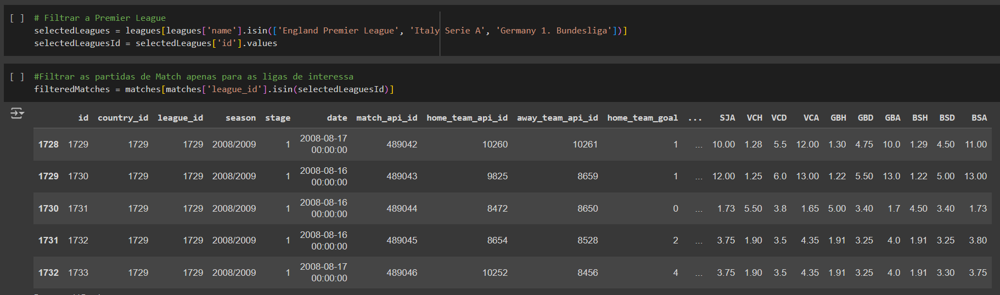{width="100%"}

Dados Brutos filtrados por Liga

---

## Pré-Processamento

***Limpeza dos Dados***

**Dados Brutos**

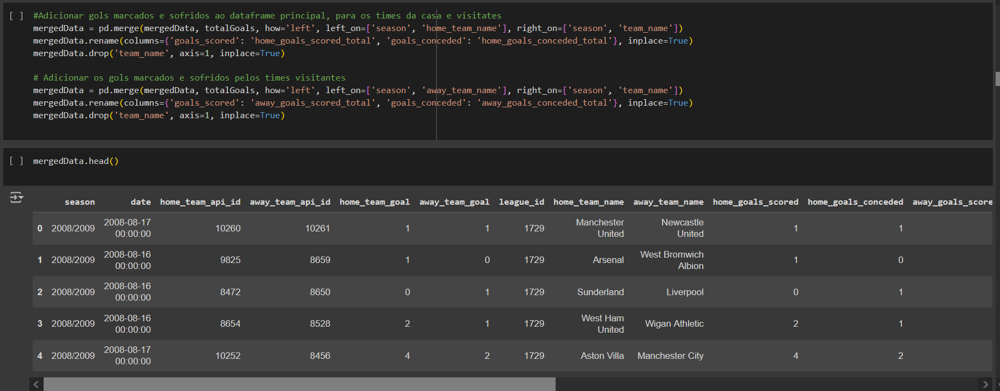{width="80%"}

Dados Brutos com times renomeados para facilitar comprensão

---

## Pré-Processamento

***Limpeza dos Dados***

**Tabela limpa**

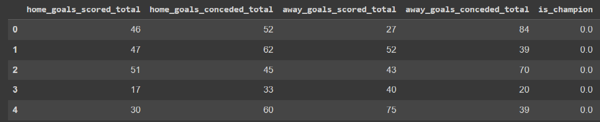{width="100%"}

Tabela final com features relevantes

---

## Configuração dos Modelos

**Variável Alvo:** is_champion;

**Random Forest**

-   n_estimators (Número de árvores): 100;

-   min_sampling_splits (Número mínimo de amostras para realizar divisão): 2;

-   max-depth (Profundidade das árvores): 10;

-   fold: 5;

**KNN**

-   n_neighbors (número de vizinhos considerados): 5;

-   fold: 5;

---

## Avaliação dos Resultados

***Boundary***

| **Random Forest**                                            | **KNN**                                                       |
|--------------------------------------------------------------|---------------------------------------------------------------|
| 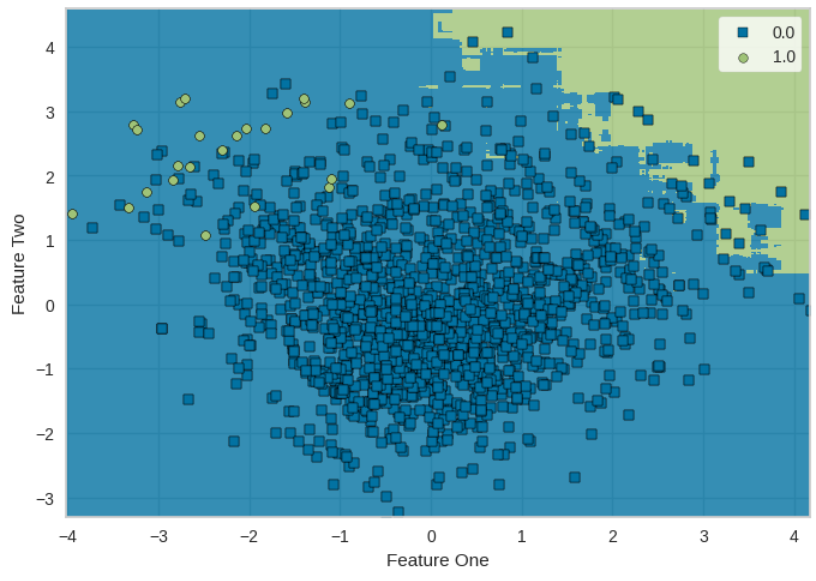{width="70%"} | 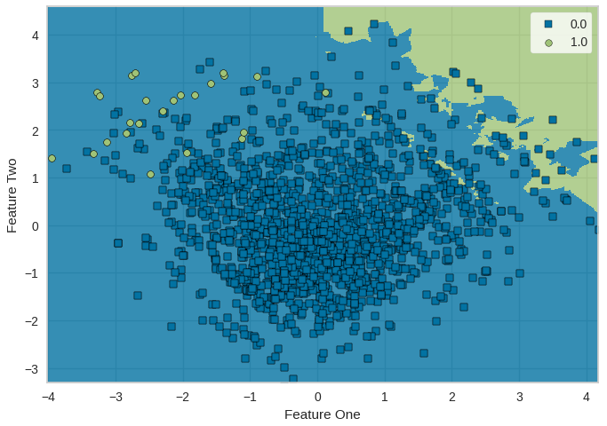{width="70%"} |

***Possíveis causas***

**1. Complexidade limitada do modelo (poucas features)**

**2. Desbalanceamento de classes**

---

## Avaliação dos Resultados

***Variáveis mais importantes***

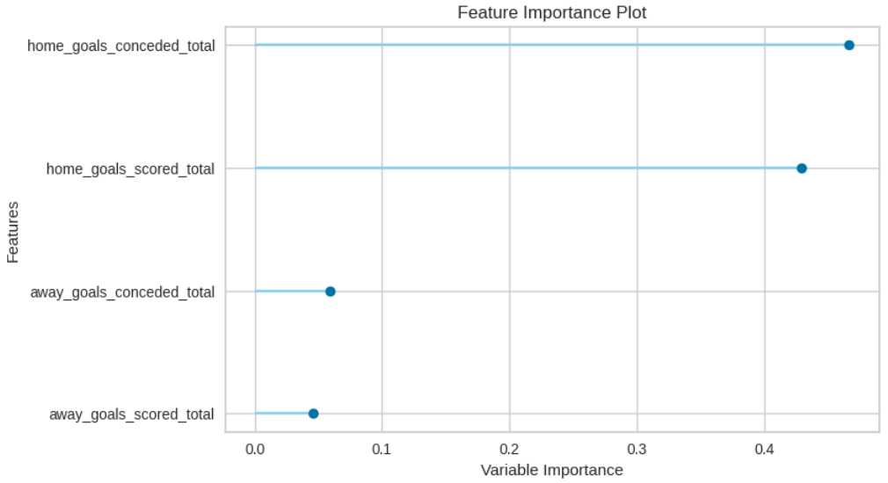{width="70%"}

---

## Avaliação dos Resultados

***Curva de Aprendizado***

| **Random Forest**                                                     | **KNN**                                                                                    |
|-----------------------------------------------------------------------|--------------------------------------------------------------------------------------------|
| 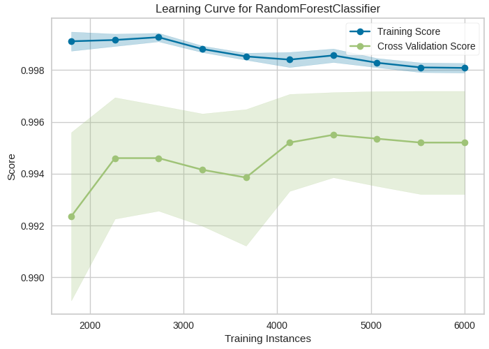{width="90%"} | 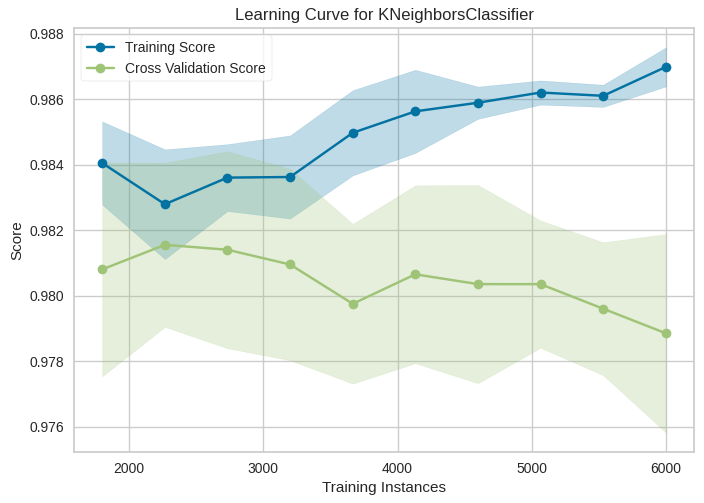{width="70%"}                     |
| Training score pode indicar overfitting (pela alta acurácia)          | Training score pode indicar overfitting (pela diferença de variação)                       |
| Cross-validation mostra bom desempenho na generalização               | Dificuldade com a generalização dos dados                                                  |
| Pouca variação indica que o modelo é consistente                      | Pode não estar encontrando padrões consistentes para generalizar e estar sensível à ruídos |

---

## Avaliação dos Resultados

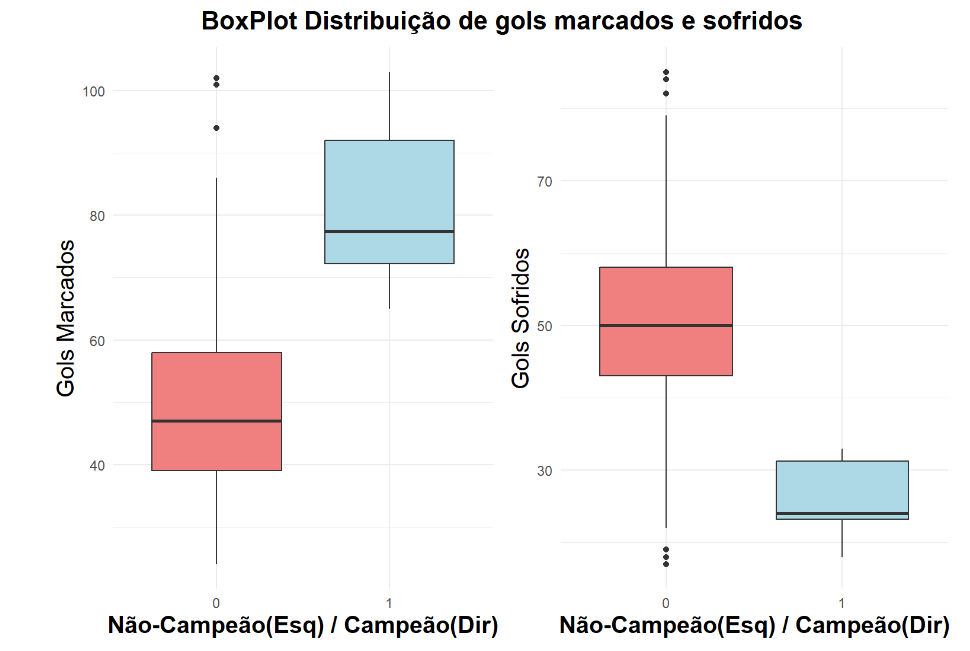{width="70%"}

---

### Avaliação dos Resultados

***Matriz Confusão***

| **Random Forest**                                                   | **KNN**                                                              |
|---------------------------------------------------------------------|----------------------------------------------------------------------|
| 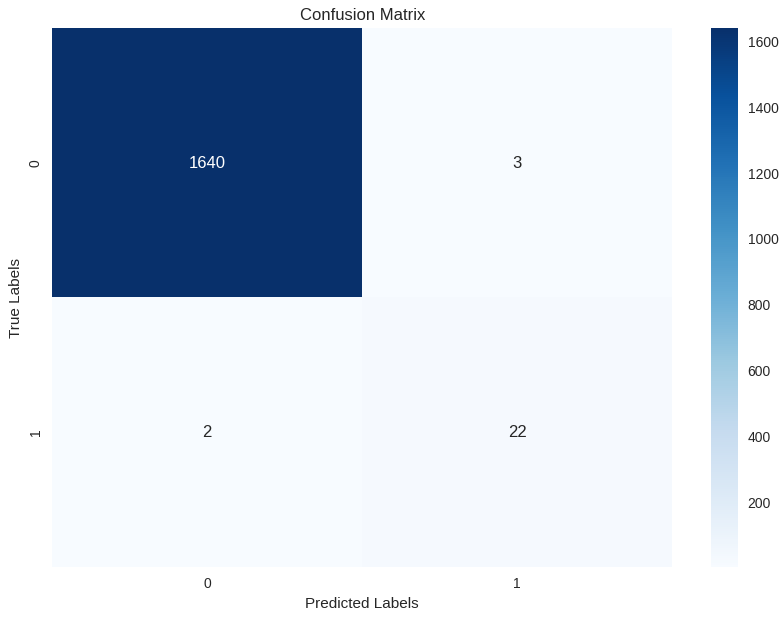{width="70%"} | 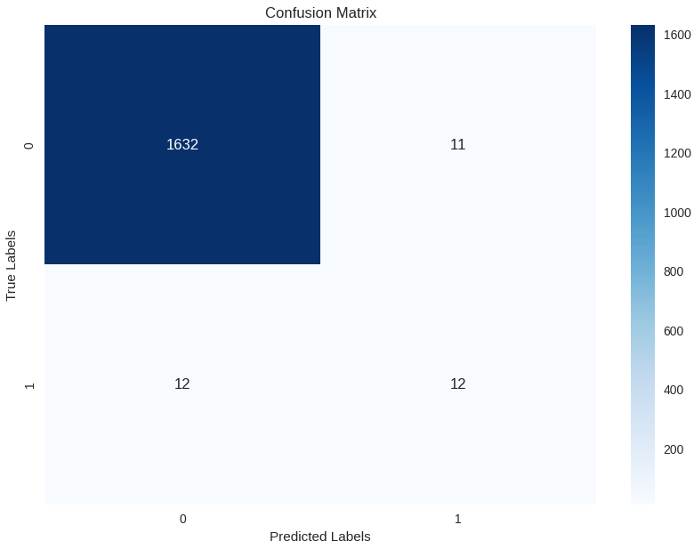{width="70%"} |

---

### Métricas Avaliadas

**Acurácia: Proporção de previsões corretas em relação ao total**

**Previsão: Proporção dos verdadeiros positivos corretos em relação ao total de positivos (falsos e verdadeiros)**

**Recall: Proporção de positivos reais**

**F1-Score: Média harmônica considerando falsos-positivos e falsos-negativos**

**Kappa: Concordância entre previsão e classificação real, punindo mais os erros**

| Métrica  | Random Forest | KNN             |
|----------|---------------|-----------------|
| Acurácia | 99.70%        | 98.62%          |
| Precisão | 88%           | 52.17%          |
| Recall   | 91.67%        | 50%             |
| F1-Score | 89.80%        | 51.06%          |
| Kappa    | 0.896         | 0.504           |
|          | Modelo Eficaz | Modelo Ineficaz |

---

## Primeiras melhorias

**Balancear as classes**

**Aumentar o número de features para dar complexidade ao modelo (posse bola, número de lesões, número e acurácia de passes, toques na área adversária, etc)**

**Encontrar a profundidade "mais ideal" para o modelo (Random Forest)**

**Encontrar o número de vizinhos que consiga captar melhores padrões (KNN)**

---

## Conclusão

**Mesmo com algumas melhorias possíveis, o modelo mostra potencial se for corretamente ajustado**

**Features iniciais mostraram um bom indicador de classificação da classe-alvo**

**Random forest mostrou maior consistência e confiança para ser usado com mais precisão em comparação ao KNN. Um ajuste posterior dos dados e modelos pode confirmar se está comparação está correta**

**É possível analisar futebol de diferentes formas: intuitiva e objetiva, com ambas possibilitando interpretações que podem se complementar**

---

## Referências

[sklearn Random Forest Documentation](https://www.scikit-learn.org/stable/modules/generated/sklearn.ensemble.RandomForestClassifier.html)

[sklearn K-nn Documentacion](https://www.scikit-learn.org/stable/modules/generated/sklearn.neighbors.KNeighborsClassifier.html)

[About Kappa](https://www.edrone.me/pt/blog/concordancia-entre-anotadores)

[Pre-processing and Predicting with Random Forest](https://www.kaggle.com/code/yogi045/preprocess-and-predicting-using-random-forest)

[Random Forest Algorithmn](https://www.e2enetworks.com/blog/random-forest-algorithm-in-machine-learning-a-guide)

[European Soccer Database](https://www.kaggle.com/datasets/abdelrhmanragab/european-soccer-database)

[IBM Knn](https://www.ibm.com/topics/knn)
